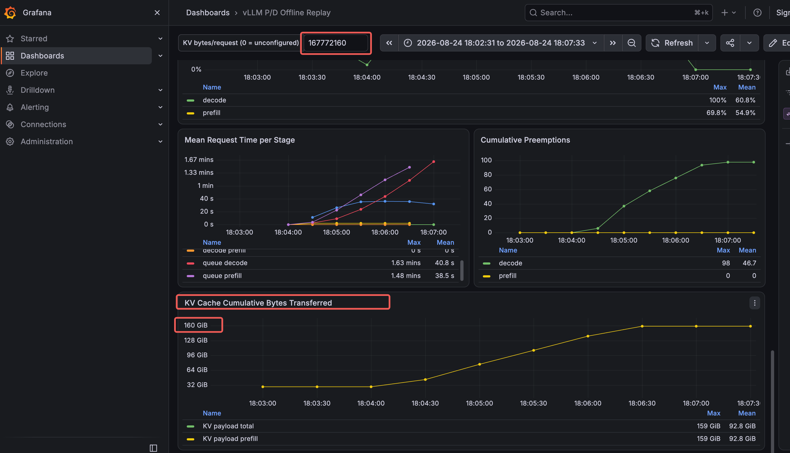
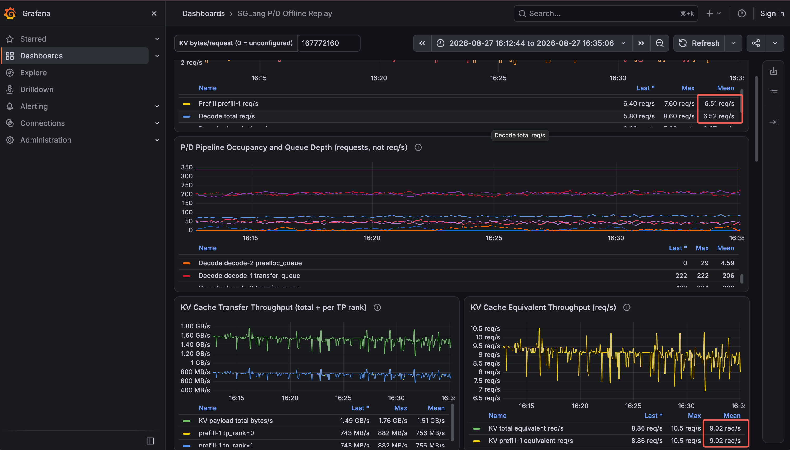
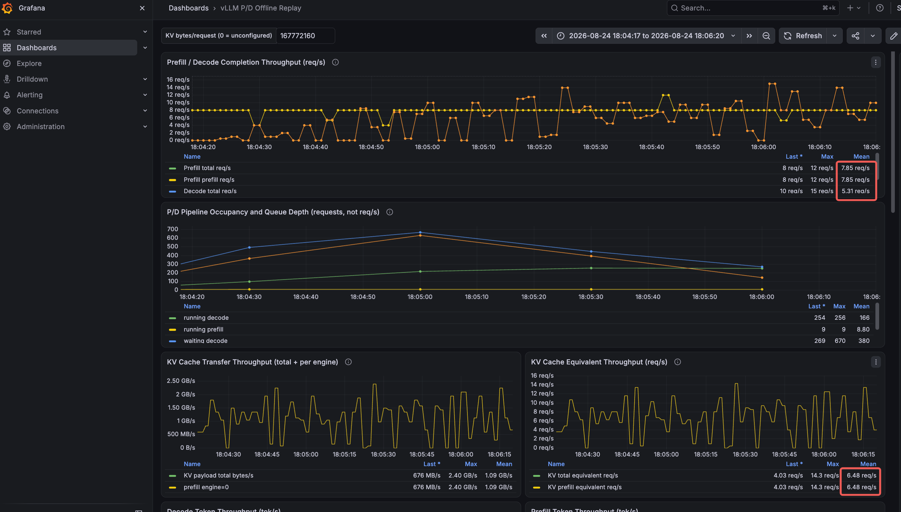

# PTD(Prefill-Transfer-Decode Profiler Tool)

1. Request throughput for the "Prefill" phase: Observe the number of requests completed by the system every 5 seconds (accounting for the impact of batching).

2. Aggregate request throughput across all RNICs: Every 5 seconds, observe the total bytes copied—calculated based on all engine processes and the default copy threads within each process. For accurate results, configure your benchmark test (e.g., `bench serve`) with 1,000–2,000 requests, each featuring an 8K input and 1K output. You can then derive the aggregate request throughput (req/s) handled by all RNICs by dividing the total KV cache data transferred by the number of requests. See Figure 1.

3. Request throughput for the "Decode" phase: Observe the number of requests completed by the system every 5 seconds (accounting for the impact of batching).



Here are tests results on vLLM/sglang within the xpyd disaggregation, allowing for the rapid identification of the slowest component in the system.




## Getting Started(offline)

`PREFILL` and `DECODE` accept paths relative to the PTD root or absolute paths inside PTD. Separate multiple instances with commas:

```bash
cd  PTD
PREFILL='log/my-run/prefill.prom.log' \
DECODE='log/my-run/decode-1.prom.log,log/my-run/decode-2.prom.log' \
DASH=ptd-sglang \
docker compose up -d
```

> U can find these logs in `PTD/log/logs-0827.tar.gz`.

### Convert logs to OpenMetrics(option)

For multiple P/D instances, assign a unique instance name to every log:

```bash
python3 src/prom2openmetrics.py \
  'prefill-1=log/my-run/prefill-1.prom.log' \
  'prefill-2=log/my-run/prefill-2.prom.log' \
  'decode-1=log/my-run/decode-1.prom.log' \
  'decode-2=log/my-run/decode-2.prom.log' \
  -o 'log/my-run/openmetrics.txt'
```

Replay the converted file:

```bash
OPENMETRICS="$PWD/log/my-run/openmetrics.txt" \
DASH=ptd-sglang \
docker compose up -d
```

After one successful replay, `docker compose up -d` reuses the latest data.

## DASH

| Value | Dashboard |
|---|---|
| `ptd-sglang` | SGLang P/D offline/online dashboard |
| `ptd-vllm` | vLLM P/D offline/online dashboard |
| `sglang` | Native SGLang live dashboard |
| `vllm` | Native vLLM live dashboard |

```bash
DASH=sglang docker compose up -d
DASH=vllm docker compose up -d
```

See [examples](examples/) for online monitoring.
